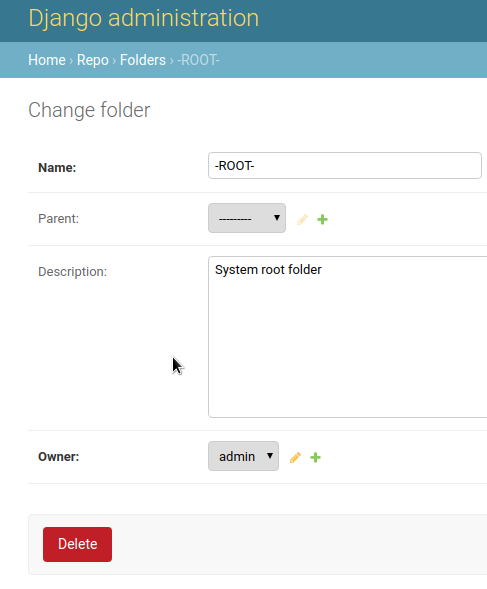
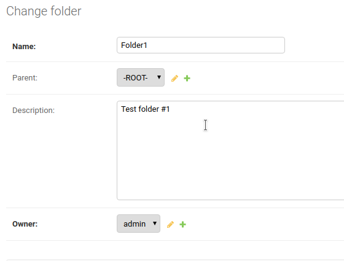

# Repositext

Content management server written with Python/Django.

## How to setup for development

* Install Python 3.8.1 -- Using pyenv (see https://github.com/pyenv/pyenv) is highly recommended.
* Clone this repo to a folder.

```
# git clone git@github.com:hseritt/repositext.git
```

* Change to the project directory (repositext).
* Install the packages in environment/requirements.txt:

```
# pip install -r environment/requirements.txt
```

You may run into an issue with installing graphviz. A quick way to solve that is by installing the graphviz-dev package.

```
# sudo apt-get install graphviz-dev
```

Be aware that you can use any database you like (even SQLite3 if you don't have a db server configured) but the project is set up to use MySQL. Just make sure that your local environment uses a local setting.py that doesn't get added to any branch you're working on (hint: put your settings-\*.py file in the .gitignore file).

* Run the project:

```
# ./manage.py runserver
```

or you can use the handy runserver.sh script that includes environment information:

```
# ./runserver [ use any normal options for manage.py runserver ]
```

You'll likely see a warning message saying that models may need to be migrated. You can do that like so:

```
# ./manage.py makemigrations
# ./manage.py migrate
```

After starting the development server, you can access http://localhost:8000/docweb/ or http://localhost:8000/admin/ if desired.

In order to use the admin console, you'll need to set up a superuser like so:

```
# ./manage.py createsuperuser
```

Follow the directions and you should then have a superuser login with password.

Once you have Repositext running, you will run into a folder not found when you open http://localhost:8000/docweb/. You will need to add a folder called '-ROOT-' (with no parent) in the admin console.



Next, to continue developing it would be good to create two more folders which are children of the -ROOT- folder:




This isn't necessary but will help you understand the rendering of the repository/folder view.
